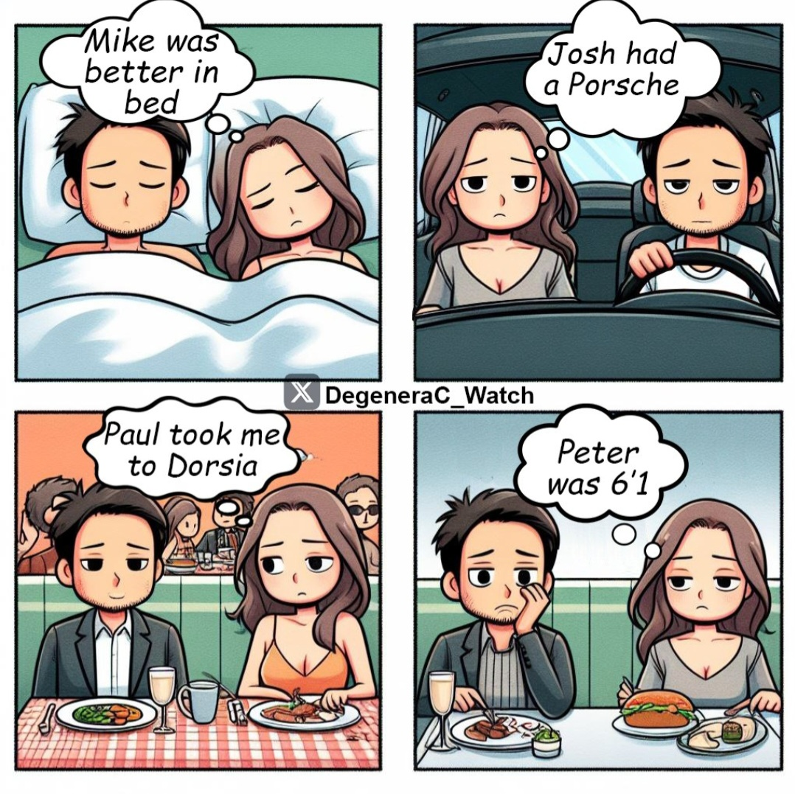

## 3.2. Trudności w znalezieniu partnera
### Problem z komunikacją i brakiem umiejętności społecznych
Współczesne realia randkowania, zdominowane przez technologie cyfrowe, uwidaczniają narastające problemy związane z komunikacją i deficytem umiejętności społecznych, szczególnie w młodszych pokoleniach. Media społecznościowe oraz aplikacje randkowe redukują interakcje międzyludzkie do krótkich, często płytkich wiadomości tekstowych, co znacząco utrudnia rozwijanie kluczowych zdolności interpersonalnych, takich jak empatia, aktywne słuchanie czy wyrażanie emocji w pełnym zakresie.

Osoby dorastające w erze cyfrowej coraz częściej napotykają trudności w nawiązywaniu relacji w bezpośrednich kontaktach. Brak praktyki w komunikacji twarzą w twarz prowadzi nie tylko do wzrostu poziomu stresu związanego z interakcjami społecznymi, ale nierzadko do unikania takich sytuacji na rzecz bardziej komfortowych i mniej wymagających form kontaktu online. W rezultacie możliwości budowania głębszych, trwałych więzi zostają znacznie ograniczone, co dodatkowo potęguje problem samotności i izolacji społecznej.

Dodatkowo, zależność od technologii wpływa na sposób formułowania myśli i przekazywania emocji. Skróty, emotikony czy gify coraz częściej zastępują tradycyjne sposoby komunikacji werbalnej i niewerbalnej. Chociaż te narzędzia są efektywne w szybkim przekazywaniu informacji, nie oddają subtelności i złożoności emocjonalnej, co prowadzi do nieporozumień i frustracji. Taki uproszczony styl komunikacji nie tylko zubaża relacje międzyludzkie, ale również ogranicza rozwój zdolności rozwiązywania konfliktów oraz budowania wzajemnego zrozumienia, które są kluczowe dla trwałych związków.

### Ghosting, breadcrumbing, catfishing i inne nowe zjawiska
W świecie współczesnego randkowania, zwłaszcza w kontekście korzystania z aplikacji randkowych, pojawiły się nowe zjawiska, które redefiniują dynamikę relacji i często generują dodatkowe trudności w ich budowaniu.

Jednym z najbardziej rozpowszechnionych zjawisk jest "ghosting" – nagłe, bez wyjaśnienia, zerwanie kontaktu z drugą osobą. To unikanie konfrontacji emocjonalnej, choć wygodne dla osoby inicjującej, prowadzi do silnego poczucia frustracji, niepewności i obniżenia samooceny u osoby porzuconej. Ghosting jest wyrazem braku odpowiedzialności emocjonalnej, co nie tylko komplikuje relacje międzyludzkie, ale również utrudnia budowanie zaufania w przyszłych kontaktach.

Innym zjawiskiem jest "breadcrumbing" – praktyka polegająca na podtrzymywaniu minimalnego kontaktu z drugą osobą poprzez sporadyczne wiadomości lub gesty, które sprawiają wrażenie zainteresowania, ale nie prowadzą do rozwinięcia relacji. Breadcrumbing, choć subtelny, utrzymuje drugą osobę w stanie ciągłej niepewności i oczekiwania, co często prowadzi do frustracji oraz poczucia zmarnowanego czasu.

Zjawisko "catfishingu" polega na tworzeniu fałszywej tożsamości w celu oszukania innej osoby, często z zamiarem wyłudzenia pieniędzy, uzyskania uwagi lub zaspokojenia własnych potrzeb emocjonalnych. Catfishing może prowadzić do poważnych konsekwencji emocjonalnych dla ofiary, takich jak poczucie zdrady, obniżenie poczucia własnej wartości czy długotrwałe trudności z zaufaniem w relacjach. W skrajnych przypadkach może także skutkować problemami prawnymi lub finansowymi.

Pokrewne terminy, które również opisują nowe zjawiska w relacjach międzyludzkich, obejmują:
* **Orbiting**: sytuację, w której osoba, po zakończeniu kontaktu, nadal obserwuje aktywność drugiej osoby w mediach społecznościowych, pozostawiając wrażenie swojej obecności, ale bez rzeczywistej komunikacji. Taka forma "niewidzialnej kontroli" utrzymuje drugą stronę w stanie niepewności.
* **Zombie-ing**: odnowienie kontaktu przez osobę, która wcześniej zniknęła bez wyjaśnienia (np. ghosting), często bez przeprosin lub wyjaśnienia przyczyn wcześniejszego zachowania.
* **Benching**: strategia polegająca na utrzymywaniu osoby "w rezerwie" poprzez sporadyczny kontakt, przy jednoczesnym aktywnym poszukiwaniu innych opcji randkowych. Takie podejście obniża poczucie wartości osoby będącej w roli "rezerwy" i komplikuje dynamikę relacji.

Te zachowania, będące często efektem nowych technologii i kultury natychmiastowej gratyfikacji, utrudniają nawiązywanie głębokich relacji, zwiększając jednocześnie poczucie alienacji i dezorientacji emocjonalnej.

### Zjawisko hipergamii u kobiet
Hipergamia, definiowana jako tendencja kobiet do poszukiwania partnerów o wyższym statusie społecznym, ekonomicznym lub edukacyjnym, odgrywa istotną rolę w kształtowaniu dynamiki współczesnego rynku matrymonialnego. W erze globalizacji i cyfrowego randkowania, gdzie możliwości wyboru partnerów są niemal nieograniczone, zjawisko to staje się jeszcze bardziej widoczne. Algorytmy aplikacji randkowych dodatkowo wzmacniają tę tendencję, promując profile osób o wysokim statusie społecznym, atrakcyjności fizycznej lub zasobach finansowych. To może prowadzić do frustracji i wykluczenia osób, które nie spełniają tych wygórowanych kryteriów.

Zjawisko hipergamii nie tylko wpływa na wybory dokonywane przez kobiety, ale również generuje trudności w znalezieniu partnera przez mężczyzn, szczególnie w społecznościach, gdzie istnieją znaczące nierówności społeczne i edukacyjne. Kobiety osiągające wysoki status zawodowy lub edukacyjny mogą napotykać trudności w znalezieniu partnerów spełniających ich oczekiwania, co dodatkowo komplikuje dynamikę współczesnych relacji.

Warto zauważyć, że hipergamia, choć głęboko zakorzeniona w wielu kulturach, podlega krytyce jako zjawisko wzmacniające nierówności płciowe i ograniczające różnorodność relacji partnerskich.

<źródło>

### Wpływ liczby partnerów u kobiet na szanse budowy szczęśliwego związku
Kwestia liczby wcześniejszych partnerów seksualnych a jej wpływ na stabilność oraz jakość przyszłych relacji pozostaje tematem szeroko dyskutowanym zarówno w literaturze naukowej, jak i debatach społecznych. Badania socjologiczne sugerują, że większa liczba partnerów może w niektórych przypadkach komplikować budowę trwałych i szczęśliwych związków. Czynniki takie jak porównania z wcześniejszymi relacjami, wzrost oczekiwań wobec obecnego partnera czy trudności w budowaniu zaufania są wskazywane jako potencjalne przyczyny takich trudności.

<źródło i mem>

Jednakże wiele z tych twierdzeń jest krytykowanych za reprodukcję stereotypów płciowych i brak uwzględnienia kontekstu kulturowego oraz osobistych doświadczeń. Alternatywne badania wskazują, że jakość relacji zależy przede wszystkim od umiejętności komunikacji, zgodności wartości, wzajemnego zaangażowania i emocjonalnej dojrzałości partnerów, a nie od liczby wcześniejszych relacji seksualnych.

Dyskusja na ten temat pozostaje istotnym elementem rozważań nad współczesnymi wyzwaniami w budowaniu relacji, uwidaczniając jednocześnie potrzebę bardziej zniuansowanego podejścia, które uwzględnia indywidualne różnice i zmienność norm społecznych.
